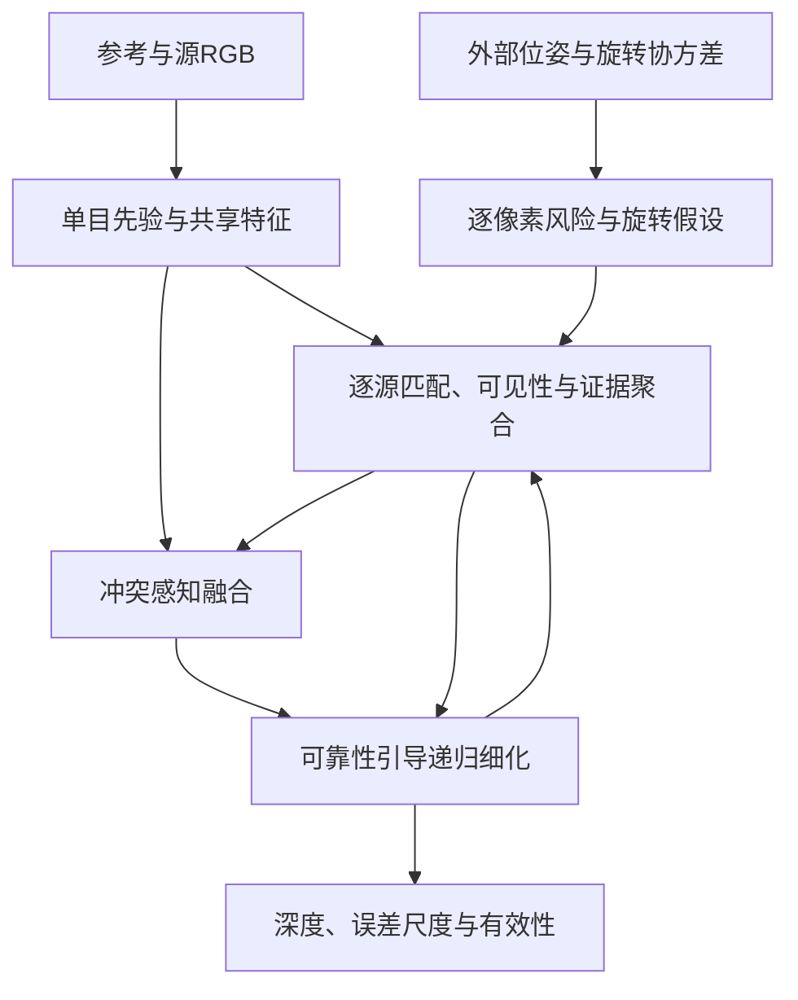

# StructMaGNet V2：从旋转不确定性到深度更新的完整设计

状态：研究设计草案，尚未实现、尚未验证性能。2026-09-08。
代码基线：`ce4c23acbea86950b206b7a1368d68f9925e2608`。
本文区分已核对的已有工作、代码事实和拟议设计；各项超参数是起始配置，不是实验结论。

## 1. 研究定位

建议目标：**在具有误差和不确定性的外部位姿下，将旋转风险传播到像素匹配，并一致地用于单目—多视图融合及深度迭代。**
最终系统接收RGB、内参、参考到源的相对位姿及可部署的旋转不确定性信息。
第一版条件于给定平移；旋转鲁棒性不等价于完整SE(3)位姿鲁棒性。
不把三个已有概念的组合、通用Transformer或增加GRU本身作为主要贡献。

| 一手工作 | 已有内容 | 对本项目的约束/启发 |
|---|---|---|
| [MaGNet, CVPR 2022](https://github.com/baegwangbin/MaGNet) | 单目高斯先验引导候选采样、结合多视图几何 | 保留可复现主干；不能把单目概率引导采样重新作为创新 |
| [IterMVS, CVPR 2022](https://arxiv.org/abs/2112.05126) | GRU隐藏状态迭代编码深度概率并预测置信度 | 必须提供参数/迭代预算匹配的普通GRU对照 |
| [RIAV-MVS, CVPR 2023](https://arxiv.org/abs/2205.14320) | 递归索引代价体，残差姿态网络修正相对位姿 | 必须比较“修正旋转均值”与“处理残余不确定性”的区别 |
| [U-ARE-ME](https://arxiv.org/abs/2403.15583) | 利用单目法线与Manhattan假设估计旋转及不确定性 | 可作为结构旋转前端；绝对方向协方差不能直接充当相对旋转协方差 |
| [MonoMVSNet, ICCV 2025](https://arxiv.org/abs/2507.11333) | 单目特征/深度先验、跨视图特征融合和候选更新 | “加入单目先验”与“边缘候选调整”已有强相关工作 |
| [MVSAnywhere, 2025](https://arxiv.org/abs/2503.22430) | 多域/深度范围泛化、可变视图和元信息处理 | 区分泛化能力与合成旋转噪声上的鲁棒性 |
| [VGGT, CVPR 2025](https://arxiv.org/abs/2503.11651)；[Depth Anything 3, 2025](https://arxiv.org/abs/2511.10647) | 统一的多视图几何推理，DA3支持有/无已知位姿 | 提供强外部参照；模型输入、尺度、预训练数据与算力必须注明 |
| [M2Depth, 2026-08-21预印本](https://arxiv.org/html/2608.20788v1) | 先验引导cost volume与单目/MVS双向递归细化 | 进一步说明双向融合/迭代本身不足以区分本项目；尚不将其称为正式录用论文 |

以上为围绕本任务的定向检索，不是对全部2026年论文的穷尽性新颖性检索。

可证伪的核心假设：

- H1：匹配分布对旋转扰动的敏感性，比单个旋转角度或熵更能预测局部几何失效。
- H2：预测冲突、可见性与风险共同驱动的融合，优于最佳固定权重及保留均值/分布的空间对照。
- H3：相同计算预算下，以这些风险构造的更新信号优于普通ConvGRU。
- H4：上述收益在估计协方差和真实前端位姿上仍成立，并保持可接受的干净位姿性能。

## 2. 当前代码到完整网络的差距

现有Gate只有entropy、peak、mono_sigma、注入角度4通道。它看不到两个候选的预测差异、有效视图覆盖、逐源匹配分歧。
`rot_unc`是已知合成扰动幅度，属于oracle实验输入。
当前forward未调用rotation sampling；旧三点假设只沿一个轴采样，不能表示一般三维协方差。
当前循环没有ConvGRU，且候选、状态、cost多处detach；解除requires_grad不足以实现联合训练。
当前sigma是两端标准差的线性插值，属于更新启发式，不是混合分布的矩匹配。
这些事实解释了需要重设计接口，但不能仅凭日志断定其中哪项是性能瓶颈。

建议保留现有 `STRUCTMAGNET.py` 与Stage1A审计，另建V2入口，避免旧检查点被静默解释为新结构。

## 3. 完整数据流与最小规模



| 部分 | 第一版配置建议 | 原因 |
|---|---|---|
| 单目主干 | 现有D-Net冻结；输出metric mu_m、Gaussian sigma_m与context | 先把结构收益与换主干收益分开 |
| 匹配特征 | 现有F-Net；先冻结，再解冻末端特征层 | 复用检查点，控制算力与训练不稳定 |
| 视图数 | 2源启动，支持1–4源与source dropout | 小显存调试后增加视图，测试视图数变化 |
| 空间尺度 | 1/8粗匹配、1/4细化；候选维使用轻量正则化 | 避免全分辨率大3D卷积 |
| 深度候选 | 1/8尺度16个；1/4尺度8个 | 起始值；与更密确定性搜索比较 |
| 旋转假设 | 原则验证Q=1/4/8；逐假设累计 | 不同时保留所有高维warp特征 |
| 递归状态 | 64通道ConvGRU；先3次更新，再对照6次 | 配平普通GRU的参数量与预算 |
| 上采样 | 复用learned convex upsampling；最后阶段再微调 | 不额外引入另一个增强网络 |

上述尺寸不是实测显存或速度保证。核对GPU实际显存，记录峰值显存后再扩大配置。
单目特征可缓存，但更新pose/深度后必须重新warp，不可缓存含GT或过期位姿的匹配结果。

## 4. Rotation-Aware Multi-View Matching

### 4.1 位姿与协方差接口

统一 `T_i0: X_i=R_i0 X_0+t_i0`，右扰动 `R_true=R_hat Exp(delta_theta)`。
`Sigma_R`单位rad²，坐标系为该右切空间，形状 `[B,V,3,3]`。
提供 `cov_available`、`observable`、`pose_valid`，缺失协方差不等价于零不确定性。

首选两条可部署输入路径：

1. 已有VO/SLAM前端直接给出相对姿态及其不确定性；先核对其协方差的定义与尺度。
2. 与稿件一致，接U-ARE-ME的法线/结构旋转估计，转换到同一全局轴系，再传播相对协方差。
   必须处理Manhattan轴置换、符号、多解及非Manhattan退化。局部小高斯无法表示90度模式跳变。

例如，若 `C_0,C_i` 是camera-to-world旋转，且都采用各自右扰动，则
`R_i0=C_i^T C_0`，一阶误差为 `delta_rel=delta_0-R_i0^T delta_i`。
由联合协方差得到：

\[
J=[I,-R_{i0}^{T}],\qquad \Sigma_{rel}=J\Sigma_{joint}J^T.
\]

没有跨帧相关项时只可声明独立近似，并在验证集上校准；不可把它写成精确传播。
若旋转前端改变了全局参考，必须先统一坐标系，保证平移仍位于同一源相机坐标。
逆Hessian只有在残差噪声、可观测性和局部模型合理时才有协方差意义；阻尼不能被当作真实观测信息。

校准时使用训练/验证数据上的旋转残差NLL、Mahalanobis覆盖率，检查偏置、尺度和各向异性。
尺度修正可从 `Sigma_cal=a Sigma_raw+b I` 起步；a、b只用校准划分拟合，最终测试固定。
大误差/多模态/不可观测的视图应标记失效或降低几何权重，不把高斯强行截窄后称为高置信。

### 4.2 将帧级协方差变成像素级风险

对深度d、参考射线r、源相机点X：

\[
X=R(dr)+t,\quad u_i=\pi(K_iX),\quad
J_R=J_{proj}(X)(-R[dr]_\times),\quad
S_R(u,d)=J_R\Sigma_RJ_R^T.
\]

`J_proj`须使用当前特征尺度的内参，因此S_R单位为该尺度的pixel²。
该一阶传播是本文提出的设计推导；它忽略平移/深度不确定性和高阶项，不应称为总投影协方差。

输入几何风险头的不仅是trace，还包括两个特征值、方向与局部图像梯度的关系。
构造局部结构张量 `A=sum_c grad(F_c) grad(F_c)^T`，`tr(A S_R)`估计局部特征对旋转扰动的敏感性。
A本身也要保留：低纹理处A接近零不意味着匹配可靠。先以有限差分/Monte Carlo核对S_R的方向与尺度。
这些特征均从图像、预测深度与估计协方差计算，推理时不需要GT。

### 4.3 保留逐源、逐旋转的证据

从 `xi_q~N(0,Sigma_R)` 构造 `R_q=R Exp(xi_q)`；同一源的一组旋转在所有像素/深度候选间共享。
从先验采样时权重为1/Q，不能再乘一次高斯密度。零协方差/关闭采样应回到确定性匹配路径。
若使用deterministic sigma points，应明确是数值积分规则及对应矩匹配，不称为iid Monte Carlo。

至少保留：名义匹配分数、跨旋转分数均值/方差、逐源深度概率、支持质量与覆盖率。
不能一开始就把所有视图和所有旋转平均为一个标量volume，随后只用entropy尝试恢复丢失的信息。

第一版默认实现与稿件一致的期望代价/分数，并保留名义volume作为旁路。
另设log-mean-exp证据聚合消融：

\[
\ell_{ik}=\log\left[\frac1Q\sum_q \exp(s_{ikq}/\tau)\right].
\]

这是经温度缩放的特征分数上的软证据聚合；只有建立并校准条件似然后才能严格称为概率边缘化。
它与 `mean(s)` 不相同；前者可能保留少数匹配峰，也可能放大偶然匹配，不能预设一定更好。
所有有效样本均等权的期望分数为主线起点；根据候选GT覆盖率与校准结果选择最终版本。

可见性至少区分：投影在图内、正深度、有限值、源深度一致性/遮挡置信度。
无效投影不作为零分数参与softmax；全无效的视图/像素必须显式回退。
当不同候选的有效旋转数量不同，不能仅对剩余项重归一化后就将其称为同一个先验边缘化。
应另传支持质量，并用固定的outlier/missing-evidence模型，或将其明确标注为条件有效的匹配分数。

### 4.4 可学习视图聚合与搜索覆盖

逐源小网络预测q_i，由几何有效性硬屏蔽；归一化权重仅在有支持时计算。
提供 `n_eff=1/sum_i w_i²`、有效视图数、跨视图深度分歧，避免网络把单个幸运匹配当多视图共识。
第一版用共享MLP/2D卷积与集合聚合，暂不增加全局跨视图Transformer。

粗尺度候选覆盖固定metric范围与单目先验邻域；细尺度围绕上一轮深度采样并保留少量宽范围候选。
记录GT落入候选范围/落在边界的比例。低熵不代表候选范围包含真值，低置信时不应机械缩窄范围。
metric mu与sigma始终保持相同单位；如果以后切换inverse depth，必须显式转换分布和损失，不直接复用sigma。

## 5. Adaptive Monocular–Multi-View Fusion

### 5.1 两个量承担不同任务

- 几何可靠性q：证据在这个像素是否可信，用于视图聚合/匹配约束权重。
- 融合系数g：在当前单目与MV预测之间如何降低深度误差，是相对效用决策。

两者可以共享特征但应有独立输出；大旋转不必在每个像素强制导致更小g。
单目本身错误时，存在噪声的MV仍可能更好。现有注入角度不得作为正式模型的独立输入。

建议融合输入包含：

| 输入组 | 具体变量 |
|---|---|
| 分支预测 | mu_m、mu_v、log sigma_m、log sigma_v |
| 预测冲突 | 有符号差值、绝对差值、差值/联合尺度；明确不是独立误差的统计检验 |
| 匹配形状 | 完整小volume编码、entropy、峰间margin、候选边界命中 |
| 证据支持 | 有效视图数、n_eff、遮挡置信度、跨视图分歧 |
| 旋转风险 | 投影风险S_R摘要、结构敏感性、跨旋转匹配波动 |
| 图像上下文 | 参考特征、纹理/边界信息 |

用小型2D残差网络将这些量压至32/64通道，输出g及供IRM使用的context。
起始 `g=0.5` 是候选配置，仍保留bias=4和固定系数对照。

### 5.2 冲突感知的分布摘要

第一版使用metric depth上的两专家混合摘要：

\[
\mu_f=(1-g)\mu_m+g\mu_v,
\]
\[
\sigma_f^2=(1-g)\sigma_m^2+g\sigma_v^2
              +g(1-g)(\mu_m-\mu_v)^2.
\]

这是高斯混合分布的前两阶矩，最后一项保留专家冲突；不是把两个相关后验相乘。
MV候选已经使用单目引导采样和上下文，两者并不独立，故不默认采用独立Gaussian precision fusion。
这些矩也不自动保证真实误差校准，应检验覆盖率和risk–coverage。
混合均值可能落在前后景之间；保留两端预测及局部volume供IRM处理，测试边界区域与mode选择基线。
单目候选和高斯sigma的有效范围、非正深度与不确定性上界必须显式处理。

## 6. Reliability-Aware Iterative Refinement

第一版采用显式深度残差状态z与ConvGRU隐藏状态h。
输入为局部cost编码、(z-mu_m)、(z-mu_v)、q/g、风险、context和能量梯度特征。
普通ConvGRU使用完全相同输入（仅移除梯度特征并配平参数）作为必要对照。

每次更新先构造固定目标和权重的局部能量：

\[
E_k(z)=\sum_u \bar w_v\rho((z-\bar\mu_v)/s_v)
             +\lambda_m\bar w_m\rho((z-\bar\mu_m)/s_m).
\]

rho首选平滑Huber；s_m/s_v有正下界，权重和尺度有稳定范围。
上横线表示计算本次梯度时固定，s_m/s_v也固定；下一次更新可以重新构建几何证据。
采用 `a_k=stopgrad(partial E_k/partial z)` 作为一阶更新特征，
`h_next=ConvGRU(h,context,cost,residuals,q,g,a_k)`，输出有界深度残差及正误差尺度。
无需推理时更新模型参数，不承诺GRU更新让能量单调下降。

对于固定端点的二次能量，存在逐像素闭式加权平均解。必须比较这个便宜解，
不能以GRU近似一个简单平均就声称是新的优化器。
GRU的价值必须来自空间context、非二次证据、候选重采样或跨轮状态，而且须由对照证明。

无有效几何时最终低分辨率深度明确回退mu_m；避免GRU无约束残差破坏单目回退性质。
高分辨率仍有上采样器，不能直接称为原始D-Net的逐位同一输出。

与当前稿件的区别：稿件写的是 `grad_h E = J_D^T grad_D E`，需要通过深度decoder在推理时反传。
建议先实现上述较轻的显式深度梯度版本；它不是稿件公式的等价实现，采用后必须同步改文稿。
仅当深度梯度版本确有收益，再单独比较latent-gradient版本及其延迟/显存，不为了符合旧公式增加复杂度。

V2梯度路径必须逐项测试：

- recurrent hidden state保留跨步计算图，全部输出接受深度监督。
- 辅助oracle目标、GT可见性标签和已冻结前端输出detach。
- 梯度特征采用first-order stop-gradient，不计算二阶项；明确这是训练近似。
- 深度状态z的正常递推梯度保留；初版可以停止梯度穿过候选生成坐标，但不能因此detach整个cost特征。
- 解冻F-Net时必须移除对应no_grad/cost.detach，使特征、warping/正则化和损失真正连接。
- 若用truncated BPTT，报告截断长度，而不是把逐步独立训练称为完整端到端训练。

## 7. 有效训练方案

### 7.1 训练目标

主损失直接监督最终要用的深度，而不是长期只拟合oracle gate：

\[
L_{depth}=\sum_{k=0}^{K}\gamma^{K-k}\,mean_{valid}\rho(\hat d_k-d^*),\quad\gamma=0.8\text{（起始值）}.
\]

建议以固定尺度Huber/Charbonnier启动，避免误差尺度头刚初始化就改变主梯度。
后续再加入小权重的校准NLL，保留固定尺度深度项，防止通过增大预测尺度弱化深度监督。
如输出Laplace尺度b，则NLL为 `|e|/b+log(2b)`，标准差为sqrt(2)b；不可直接作为Gaussian采样sigma。

总目标按阶段启用，而非第一天把所有项相加：

\[
L=L_{depth}+\lambda_{mv}L_{mv}+\lambda_{match}L_{match}
 +\lambda_qL_q+\lambda_g(t)L_{gate}+\lambda_{cal}L_{cal}.
\]

- L_mv：独立MV头的有效深度监督，避免融合长期忽略MV后其分支失去训练信号。
- L_match：候选深度分布的软标签交叉熵，仅在GT落入可表示候选范围时使用；同时统计范围外比例。
- L_q：使用GT几何构造的可见性/匹配成功标签或冻结候选误差标签，训练时可用GT，推理时不可。
  标签须针对定义好的事件（如相对误差小于阈值），而不是把“比单目好”混称为绝对可靠。
- L_gate：短期辅助；沿用有界插值oracle可作为诊断，目标端点stop-gradient。
  更重视直接融合深度误差或相对于逐像素最优插值的regret，避免在两端几乎相等处浪费梯度。
- L_cal：预测误差分布NLL和独立评估的校准指标，不能只用置信度均值作为校准证据。

lambda用固定小训练子集的梯度规模先校验，然后在验证集选择并冻结。
不预设不同损失同一个数值权重就有相同训练强度；记录各分支梯度范数和更新范数。

### 7.2 分阶段优化及进入条件

| 阶段 | 训练模块 | 目标与进入下一阶段条件 |
|---|---|---|
| S0：测量系统 | 冻结主干/前端 | 完成已有Gate审计、投影mask、坐标/协方差校验；可靠性不是角度捷径 |
| S1：几何证据 | 匹配adapter、MV头、q头 | 从干净/轻噪声开始；MV候选有真值覆盖，优于未经适配的新匹配版本 |
| S2：融合 | 冻结两专家，训练fusion | bias/loss受控比较；超过固定g、image_mean、shuffle；不过早训练IRM掩盖Gate问题 |
| S3：递归细化 | ConvGRU、深度/尺度头，随后联合fusion | 所有迭代接受监督；超过预算匹配GRU和闭式融合；检查每轮误差与漂移 |
| S4：有限联合微调 | 上述模块加F-Net末端/G-Net adapter；D-Net先冻结 | 使用真实前端位姿/估计协方差；保持clean性能，验证收益跨序列/场景稳定 |

优化初值可沿用AdamW：新模块1e-4，解冻主干1e-5，gradient clipping=1。
比较时控制optimizer steps而非仅epoch；首先验证小训练集可过拟合及梯度连接，再扩大数据。
有效batch可由batch=1加4次梯度累积启动；AMP中的SO(3)、logsumexp、方差、NLL保留FP32。
新头采用稳定初值；只用单一合成数据集和很短训练不能证明网络能力或鲁棒性上限。

### 7.3 噪声与可靠性课程

初始保留约一半干净样本，逐渐覆盖轻度和中度旋转误差；比例作为可调起点。
每个阶段持续保留干净样本，避免把全局关闭MV学成最优策略。
同一图像窗口生成干净/扰动配对，分别用相同GT监督深度；不要强制两种条件得到相同深度或逐像素单调g。
增加低视差、视图缺失、部分源失效、遮挡、曝光变化、弱纹理和单目先验错误样本。

必须分开三种评价/训练条件：

1. 可控生成分布Sigma，实际旋转误差从该分布采样；输入分布参数，不输入实际误差角度。
2. 协方差低估/高估、各向异性、相关/有偏旋转扰动，检验模型是否只记住训练噪声规则。
3. 实际U-ARE-ME或VO/SLAM产生的旋转与协方差，避免oracle元信息依赖。

合成真实协方差仍属于受控条件，不能冒充估计器输出。
多源共享参考姿态导致误差相关；训练不能只有独立每源噪声。
额外引入轻度平移错误作为失效边界测试；第一版不声称解决平移风险。

## 8. 数据与验证

本地chess/office/redkitchen可用于接口调试和小规模消融，heads保留作未参与本次训练的场景测试。
数据划分以现有TrainSplit/TestSplit及序列为单位；不能随机分帧导致相邻窗口泄漏。
“heads未参与本次微调”不自动等于所有基础模型从未见过该场景，须检查预训练数据。

若做完整泛化/机器人论文：用ScanNet多场景训练和序列验证，7-Scenes做跨场景/跨数据集测试；
TartanAir可用于可控大范围几何、旋转/平移干预，需另写数据/位姿适配且不可默认已具备。
RGB-D深度有效性、尺度、内参和图像—深度配准须先验证，否则Gate可能在拟合配准误差。
这里的真实数据建议是后续规划，不代表已下载或训练。

必要实验矩阵：

| 因素 | 必须比较 |
|---|---|
| 主干 | 同一D/F主干上的MaGNet、V2；强foundation模型另列预训练与输入条件 |
| 旋转 | 名义位姿；均值修正；采样；修正+采样；更密确定性深度搜索；各项预算注明 |
| 风险 | 无cov；标量trace；S_R风险；匹配敏感性；估计cov；错误cov |
| 融合 | 固定g；learned；image_mean；shuffle；无冲突项；完整模型 |
| IRM | 无IRM；固定端点闭式解；普通ConvGRU；梯度ConvGRU；必要时latent-gradient |
| 训练 | 只gate oracle；直接深度；有/无辅助gate；逐轮监督；有/无真实前端数据 |

最终报告RMSE/AbsRel/a1、完整深度有效率、旋转噪声—误差曲线、边缘/低纹理/遮挡分组、
NLL/误差覆盖率/risk–coverage、逐轮收益、端到端延迟和显存。
前端法线/旋转计算时间不能从系统总时延中消失；可以同时列“缓存前端的深度后端”和“完整系统”。
采样和输入风险模块各自带来的额外warp/算力需要配平，而非仅比较参数量。
用多个训练种子；统计不确定性按序列/场景汇总或bootstrap，避免把相邻像素当独立样本。

对最终贡献的保留规则：

- 采样不如相同预算的确定性搜索/均值修正：降低其贡献等级或移除，不通过换测试集保留。
- learned不优于image_mean/shuffle：不声称像素级选择有效。
- IRM不优于普通GRU/闭式解：优先删减，缩小论文范围。
- 只有oracle协方差有效：论文仍停留在上限分析，不能声称可部署旋转鲁棒系统。

## 9. 代码实施边界与顺序

以下是拟新增接口，不是当前可运行命令：

```text
models/structmagnet_v2.py
models/submodules/pose_risk.py
models/submodules/rotation_matching.py
models/submodules/view_evidence.py
models/submodules/conflict_fusion.py
models/submodules/reliability_refiner.py
utils/structmagnet_losses.py
train_structmagnet_v2.py
```

核心张量契约：

- pose adapter：R `[B,V,3,3]`，t `[B,V,3]`，Sigma_R `[B,V,3,3]`，可用性/可观测性标志。
- evidence：候选 `[B,D,Hs,Ws]`，逐源匹配/支持 `[B,V,D,Hs,Ws]`；风险保留逐源维。
- fusion：两端mu/sigma、g/q/context；每个分布明确depth单位及参数类型。
- refiner：depth/h/误差尺度；返回所有迭代预测、候选覆盖与回退mask。

实施顺序：

1. 先实现pose_risk与完整投影mask，核对Jacobian和MC传播，再接逐源evidence接口。
2. 实现单步conflict_fusion，端点冻结，用已有audit思想验证真正的空间选择收益。
3. 实现带明确梯度路径的ConvGRU和全步深度损失，保留plain-GRU开关。
4. 接可部署协方差前端、真实姿态数据，再决定是否需要升级基础特征网络。

没有数值验证时不要一次性替换主干、匹配、loss和GRU后仅报告一个总分。
可先把完整接口和前向结构搭好，但训练应按上述阶段启用，才能定位失败原因。
